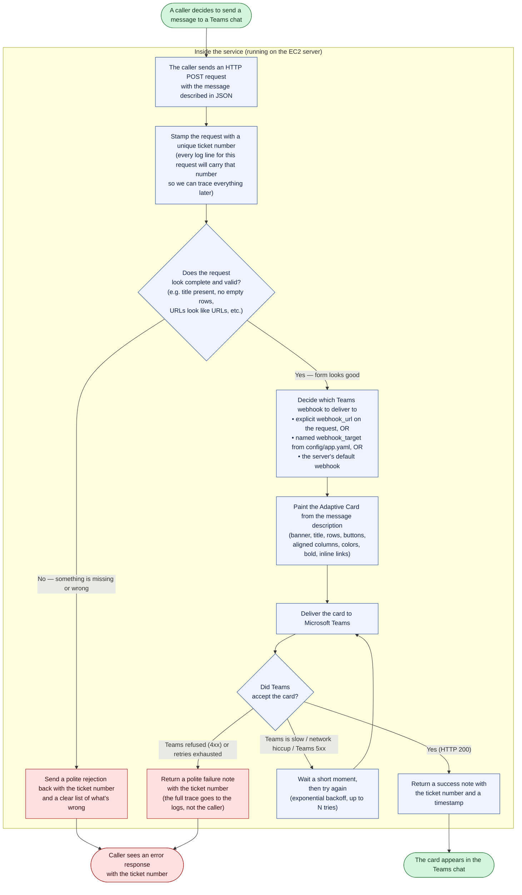
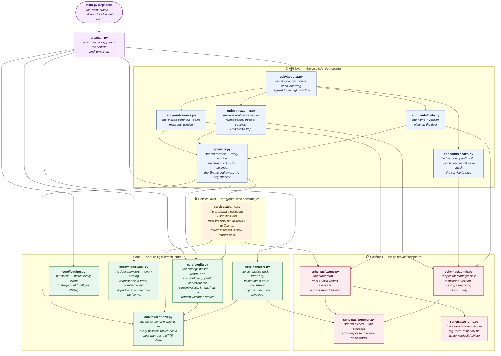

# microservice-instant-messages

A small web service that takes a plain-English description of a message and delivers it to a Microsoft Teams chat as a nicely-styled card. You tell it "banner with red alert, title in bold, a row of ticket info, two buttons at the bottom" and it figures out all the Adaptive Card JSON, sends it to Teams, and tells you whether it worked.

Built on FastAPI. Containerised. Deployed to EC2 through GitHub Actions. Everything is wired up for production: configuration, logging, retries, health checks, admin endpoints, tests.

---

## How a message travels through the service

This is what happens from the moment a caller decides to send a message, to the moment the card appears in Teams. Every shape in this picture is a real thing inside the service; the language is deliberately non-technical.



Two supporting cycles worth mentioning that don't fit in the flow above:

- **Startup**. When the service boots, it reads `.env` and `config/app.yaml`, opens a connection pool to Teams, and only *then* says "I'm ready". Liveness/readiness endpoints reflect this.
- **Shutdown**. On `Ctrl+C` or a container stop signal, the service finishes in-flight requests, closes the connection pool, and exits cleanly.

---

## The codebase at a glance

This map shows every important file in the repo and how they depend on each other. The entry point is the root `main.py`; every arrow means "the file at the tail of the arrow needs the file at the head". The italic text under each filename is a one-line layperson description of what the file is *for*.



### One-line purpose of every file (plain English)

| File | What it's for |
|---|---|
| `main.py` (repo root) | The one-button launcher. Starts the web server. Nothing else. |
| `src/main.py` | Assembles all the pieces — middleware, error handlers, routes — and hands you a ready-to-serve app. |
| `src/api/v1/router.py` | A directory that says "health calls go here, Teams calls go there, admin calls go in that corner." |
| `src/api/v1/endpoints/teams.py` | The window that accepts "please send this to Teams" requests. |
| `src/api/v1/endpoints/health.py` | The bell other systems ring to ask "are you up? are you ready?" |
| `src/api/v1/endpoints/admin.py` | Manager-only. Reload config from disk, show the current settings (with secrets hidden). Needs the admin key. |
| `src/api/v1/endpoints/meta.py` | Like the little plate next to your doorbell: name of the service, version. |
| `src/api/deps.py` | The shared toolbox every endpoint reaches into — settings, the Teams worker, the admin-key check, request id. |
| `src/services/teams.py` | The actual worker: turns your message description into an Adaptive Card and delivers it to Teams. Retries on flaky networks, gives up on bad requests. |
| `src/core/config.py` | Reads `.env` and `config/app.yaml`. Remembers the values. Can reload from disk on demand without a restart. Masks secrets when you ask for a settings snapshot. |
| `src/core/logging.py` | Decides how log lines look. JSON in production (for log shippers), readable for local development. |
| `src/core/middleware.py` | Stamps every request with a unique ticket number, then writes one line in the journal per request with how long it took and how it ended. |
| `src/core/exceptions.py` | A neatly-organised family tree of every possible failure the service can raise. Each branch has a stable name and an HTTP status. |
| `src/core/handlers.py` | The complaints desk. Catches any failure — yours, the framework's, or a completely unexpected crash — and turns it into the same consistent response envelope. Never leaks internals to the caller; full stack traces still go to the logs. |
| `src/schemas/teams.py` | The form that describes a valid Teams message: what a banner looks like, what a row looks like, what a button looks like. |
| `src/schemas/admin.py` | The forms for admin and version endpoints. |
| `src/schemas/common.py` | Shared form pieces used by every other form, including the uniform error shape. |
| `src/schemas/enums.py` | The allowed-word lists: "weight may only be lighter / default / bolder", "banner style may only be attention / warning / good / accent / emphasis / default", etc. |
| `config/app.yaml` (+ `.example`) | Non-secret runtime config. Lists named webhooks, timeouts, CORS, defaults. Mountable into the container. |
| `.env` (+ `.example`) | Secrets and deployment values. Default webhook URL, admin key, log level. Gitignored. |
| `Dockerfile` | Recipe for building the container image. |
| `docker-compose.yml` | How to run the container on the server (port mapping, volume mounts, restart policy, healthcheck). |
| `.github/workflows/ci.yml` | The automatic pipeline: on every push to `main`, run tests, and if *code* changed, build the image, push it to the registry, and deploy to EC2. |
| `tests/` | 31 tests — card rendering, every API endpoint, every error path, admin-key rules, config reload. |
| `artifacts/` | Historical reference only. Contains the original one-file script this whole project grew out of, plus a ready-made smoke-test payload. |

---

## Features

- **High-level message DSL** — describe banners, rows (left / right / both), buttons, inline markdown links; the service builds the Adaptive Card JSON for you.
- **API versioning** — everything lives under `/api/v1/...`.
- **Config from `.env` + YAML** — both files are mountable as Docker volumes and reloadable without a restart.
- **Typed exception hierarchy** — every failure gets a stable `code` and a uniform `ErrorResponse` envelope.
- **Retry with exponential backoff** on timeouts, network errors, and downstream 5xx (never on 4xx).
- **Structured JSON logging** with `X-Request-ID` correlation on every request and log line.
- **OpenAPI / Swagger UI** out of the box with descriptions on every field.
- **Health / readiness probes** for orchestrators.
- **Admin endpoints** (X-Admin-Key gated) to reload config and inspect the current settings (with secrets masked).
- **Containerised + automated deploy** — `docker compose` on the host, pushes to `main` trigger a GitHub Actions pipeline that builds and deploys only when code actually changed.

---

## Quickstart (local)

```bash
# 1. Install deps
uv sync

# 2. Configure
cp .env.example .env
#   set DEFAULT_TEAMS_WEBHOOK_URL and ADMIN_API_KEY
cp config/app.yaml.example config/app.yaml
#   optional: add entries under teams.named_webhooks

# 3. Run
uv run python main.py
#   or: uv run uvicorn src.main:app --reload

# 4. Open docs
# http://localhost:8000/docs
```

---

## Production deployment

Deployment is automated by [.github/workflows/ci.yml](.github/workflows/ci.yml):

1. Every push to `main` runs the full test suite.
2. A paths filter checks whether **code** changed (anything under `src/`, `main.py`, `pyproject.toml`, `uv.lock`, `Dockerfile`, `docker-compose.yml`, `.github/workflows/**`, or `config/app.yaml.example`). README-only and other docs-only pushes skip the build+deploy jobs.
3. When code did change, the image is built and pushed to GHCR.
4. The deploy job SSHes into the EC2 host, does `git reset --hard origin/main`, `docker compose pull`, `docker compose up -d`, and then probes `/api/v1/health` until the container reports healthy.

The container binds to `127.0.0.1:8014` on the host — not directly exposed to the internet. Put it behind nginx (or your preferred reverse proxy) when you need public access.

Required repo secrets (set once via `gh secret set`):

| Secret | Value |
|---|---|
| `DEPLOY_HOST` | EC2 public IP / DNS |
| `DEPLOY_USER` | SSH user (e.g. `ubuntu`) |
| `DEPLOY_PORT` | SSH port (optional; default `22`) |
| `DEPLOY_SSH_KEY` | contents of the private key |
| `DEPLOY_GIT_PATH` | absolute path on the server where the repo is cloned |
| `GHCR_USER` | GitHub username (lowercase) |
| `GHCR_TOKEN` | PAT with `read:packages` (pull) + `write:packages` (push) |

---

## Repository layout

```
.
├── artifacts/                 # historical — original CLI + smoke-test payload
├── config/
│   ├── app.yaml               # non-secret runtime config (gitignored, volume-mountable)
│   └── app.yaml.example
├── src/
│   ├── main.py                # create_app() FastAPI factory + lifespan
│   ├── api/
│   │   ├── deps.py            # DI: settings, TeamsService, admin auth
│   │   └── v1/
│   │       ├── router.py      # composes everything under /api/v1
│   │       └── endpoints/     # teams, health, admin, meta
│   ├── core/
│   │   ├── config.py          # Settings + YAML source + reload
│   │   ├── logging.py         # JSON / pretty formatters
│   │   ├── middleware.py      # RequestID + access log
│   │   ├── exceptions.py      # typed AppError hierarchy
│   │   └── handlers.py        # global exception handlers
│   ├── schemas/               # Pydantic models with Field descriptions
│   └── services/teams.py      # render_card + send + retry + exception mapping
├── tests/                     # 31 tests
├── Dockerfile
├── docker-compose.yml
├── .github/workflows/ci.yml
├── main.py                    # thin root launcher -> uvicorn
└── pyproject.toml
```

---

## API surface

All endpoints are under `/api/v1`.

| Method | Path                   | Purpose                                             |
|-------:|------------------------|-----------------------------------------------------|
|   GET  | `/health`              | Liveness probe (always 200 while the process is up) |
|   GET  | `/health/ready`        | Readiness probe (200 once the lifespan has run)     |
|   GET  | `/version`             | Returns `{name, version}` from settings             |
|  POST  | `/teams/messages`      | Send an Adaptive Card to a Teams webhook            |
|  POST  | `/admin/reload-config` | Reload `.env` + YAML from disk (needs `X-Admin-Key`) |
|   GET  | `/admin/config`        | Current settings, secrets masked (needs `X-Admin-Key`) |

### POST `/api/v1/teams/messages`

Minimal payload:

```json
{
  "title": {"text": "Hello from the microservice"}
}
```

Rich payload with every feature exercised:

```json
{
  "banner": {"text": "SYSTEM DEGRADED", "style": "attention", "bold": true},
  "title":  {"text": "Stroke workflow alert", "weight": "bolder", "size": "medium"},
  "rows": [
    {"left": {"text": "Ticket"}, "right": {"text": "#5432"}},
    {"left": {"text": "Age"},    "right": {"text": "67 minutes"}, "separator": true},
    {"left": {"text": "See [the ticket](https://desk.zoho.com/ticket/5432)."}}
  ],
  "buttons": [
    {"title": "Open Ticket", "url": "https://desk.zoho.com/ticket/5432"}
  ],
  "webhook_target": "superstat"
}
```

Webhook selection priority:

1. `webhook_url` — one-off override on the request.
2. `webhook_target` — look up in `config/app.yaml` -> `teams.named_webhooks`.
3. `DEFAULT_TEAMS_WEBHOOK_URL` from `.env`.

---

## What the card DSL supports

| DSL feature              | Adaptive Card primitive used                     |
|--------------------------|--------------------------------------------------|
| Row with left + right    | `ColumnSet` with `stretch` + `auto` columns      |
| Bold / size / color      | `TextBlock.weight`, `.size`, `.color`            |
| Banner (themed colors)   | `Container{style: attention/warning/good/accent/emphasis}` |
| Button opening a URL     | `Action.OpenUrl`                                 |
| Inline clickable link    | Markdown inside TextBlock: `[label](https://...)`|
| Separator line above row | `separator: true`                                |

---

## Error contract

Every non-2xx response uses the same envelope:

```json
{
  "error": {
    "code":    "WEBHOOK_REJECTED",
    "message": "Teams rejected the request.",
    "details": {"status": 400, "body_excerpt": "..."}
  },
  "request_id": "c5b1f...-..."
}
```

| Code                    | HTTP | Meaning                                         |
|-------------------------|-----:|-------------------------------------------------|
| `VALIDATION_ERROR`      |  422 | Request body failed schema/validator            |
| `UNKNOWN_WEBHOOK_TARGET`|  400 | Named webhook not configured                    |
| `WEBHOOK_TIMEOUT`       |  504 | httpx timed out                                 |
| `WEBHOOK_NETWORK_ERROR` |  502 | DNS / connect / TLS / read error                |
| `WEBHOOK_REJECTED`      |  502 | Teams returned 4xx (not retried)                |
| `WEBHOOK_SERVER_ERROR`  |  502 | Teams returned 5xx (after retries)              |
| `ADMIN_KEY_MISSING`     |  503 | Server has no ADMIN_API_KEY set                 |
| `ADMIN_KEY_INVALID`     |  401 | Wrong or missing X-Admin-Key                    |
| `CONFIG_INVALID`        |  500 | Malformed YAML at reload time                   |
| `INTERNAL_ERROR`        |  500 | Anything unexpected (full trace logged, generic message returned) |

---

## Configuration reference

### `.env`

| Variable                      | Default             | Purpose                                         |
|-------------------------------|---------------------|-------------------------------------------------|
| `DEFAULT_TEAMS_WEBHOOK_URL`   | —                   | Fallback webhook when request omits a target    |
| `ADMIN_API_KEY`               | —                   | Required on `X-Admin-Key` for `/admin/*`        |
| `LOG_LEVEL`                   | `INFO`              | `DEBUG` / `INFO` / `WARNING` / `ERROR`          |
| `LOG_FORMAT`                  | `json`              | `json` (prod) or `pretty` (dev)                 |
| `HTTPX_TIMEOUT_SECONDS`       | `15`                | Per-request outbound timeout                    |
| `WEBHOOK_MAX_RETRIES`         | `2`                 | Retries for timeouts / network / 5xx only       |
| `CORS_ALLOW_ORIGINS`          | `["*"]`             | JSON list (via pydantic-settings)               |
| `ENV_FILE`                    | `./.env`            | Override path (for Docker volume mounts)        |
| `CONFIG_FILE`                 | `./config/app.yaml` | Override YAML path                              |

### `config/app.yaml`

```yaml
teams:
  named_webhooks:
    superstat: "https://..."
  defaults: { banner_style: attention, title_weight: bolder, title_size: medium }
http:
  timeout_seconds: 15
  max_retries: 2
api:
  cors:
    allow_origins: ["*"]
```

### Reload without restart

Edit either file, then:

```bash
curl -X POST http://localhost:8000/api/v1/admin/reload-config \
  -H "X-Admin-Key: $ADMIN_API_KEY"
```

The response lists which sources contributed (`env`, `dotenv`, `yaml`).

---

## Testing

```bash
uv run pytest
```

The suite covers:
- card rendering (every DSL permutation -> expected JSON)
- HTTP endpoints (happy path + every error code)
- webhook failure mapping (timeout / network / 4xx / 5xx)
- admin-key enforcement
- config reload from a mutated YAML on disk
- uniform error envelope + internal-error leak prevention

---

## The preserved CLI

The original minimal CLI script is at [artifacts/main.py](artifacts/main.py) and still works as a one-off smoke test against a webhook URL. A ready-made payload for a rich smoke-test is at [artifacts/smoke_rich.json](artifacts/smoke_rich.json).
